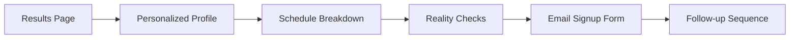

# Immersion Intensity Calculator - Technical Specification

## Table of Contents

1. [Project Overview](#project-overview)
2. [Core Objectives](#core-objectives)
3. [User Flow Architecture](#user-flow-architecture)
4. [Detailed Question Specifications](#detailed-question-specifications)
5. [Calculation Logic & Algorithms](#calculation-logic--algorithms)
6. [User Interface Requirements](#user-interface-requirements)
7. [Email Capture & Follow-up System](#email-capture--follow-up-system)
8. [Content Management System](#content-management-system)
9. [Technical Implementation](#technical-implementation)

---

## Project Overview

The **Immersion Intensity Calculator** is a comprehensive web application designed to serve as the primary lead magnet for a language learning website focused on immersion-based acquisition methods. The calculator provides personalized immersion schedules, reality checks, and actionable guidance based on users' goals, lifestyle, and current proficiency.

### Target Audience
- Language learners seeking personalized guidance
- People frustrated with traditional learning methods
- Individuals looking for realistic timeline expectations
- Prospective customers for immersion-based learning services

---

## Core Objectives

### 🎯 Primary Goals

| Objective | Description | Success Metrics |
|-----------|-------------|-----------------|
| **Lead Generation** | Capture email addresses for newsletter signup and follow-up sequences | Email conversion rate >25% |
| **Personalized Assessment** | Provide tailored recommendations based on individual circumstances | User satisfaction ratings >4.5/5 |
| **Educational Tool** | Teach immersion principles through interactive assessment | Time on site >8 minutes |
| **Reality Calibration** | Deliver honest feedback about timeline expectations vs. actual commitment | Engagement with follow-up emails >40% |
| **Community Building** | Create "aha moments" that convert visitors into engaged learners | Newsletter signup rate >20% |

---

## User Flow Architecture

### Phase 1: Assessment (Questions 1-14)

```mermaid
graph LR
    A[Start] --> B[Q1: Language Selection]
    B --> C[Q2: Current Method]
    C --> D[Q3: Motivation]
    D --> E[Q4: Time Commitment]
    E --> F[Q5: Lifestyle]
    F --> G[Q6: Current Level]
    G --> H[Q7: Content Habits]
    H --> I[Q8: Vocabulary System]
    I --> J[Q9: Grammar Approach]
    J --> K[Q10: Timeline Goals]
    K --> L[Q11: Accent Priority]
    L --> M[Q12: Speaking Priority]
    M --> N[Q13: Learning Obstacles]
    N --> O[Q14: Communication Style]
    O --> P[Results Page]
```


### Phase 2: Results & Capture


---

## Detailed Question Specifications

### Question 1: Language Selection + Learning History

**Type:** Dropdown + Multiple Choice  
**Purpose:** Establish baseline context without judgment

#### Question Text
> "Which language are you learning, and how long have you been at this?"

#### Language Dropdown Options
- Korean
- Japanese  
- Spanish
- French
- German
- Italian
- Portuguese
- Chinese (Mandarin)
- Arabic
- Other

#### Timeline Options
- **"Just getting started (less than 3 months)"**
- **"I've been grinding for 3-12 months"**
- **"It's been 1-2 years of this journey"**
- **"2+ years and still here"**

#### Explanation Text
> "No judgment here. Whether you just discovered Korean exists or you've been studying longer than some people stay married, we need to know where you're starting from. Time spent doesn't equal progress made - that's why you're here."

---

### Question 2: Current Method Assessment

**Type:** Multiple Choice (Single Select)  
**Purpose:** Understand current approach without assumptions

#### Question Text
> "What does your current language learning actually look like?"

#### Options
- **"Daily apps (Duolingo, Babbel, etc.)"**  
  *I'm consistent with apps but not much else*

- **"Weekly classes or tutoring sessions"**  
  *I have structured lessons with a teacher*

- **"Self-study with books and courses"**  
  *I work through textbooks and online courses on my own*

- **"Consuming media in my target language"**  
  *I watch shows, read content, listen to podcasts*

- **"Mix of different approaches"**  
  *I'm doing a bit of everything*

- **"Just getting started with everything"**  
  *I'm still figuring out what works for me*

#### Explanation Text
> "No judgment here. I've tried everything from Pimsleur to grammar marathons to watching K-dramas with English subtitles. What matters isn't what method you're using - it's understanding where you are so we can build from there."

---

### Question 3: Motivation Assessment

**Type:** Multiple Choice (Multiple Select)  
**Purpose:** Capture deep motivational drivers for personalized guidance

#### Question Text
> "What's driving you to learn [Target Language]? Check all that apply."

#### Options (Checkboxes)
- ☐ **"Support my education/studies"**  
  *I need this for school, research, or academic goals*

- ☐ **"Connect with people and culture"**  
  *I want to build real relationships and understand perspectives*

- ☐ **"Spend time productively"**  
  *I'm tired of scrolling - want to invest in something meaningful*

- ☐ **"Prepare for travel or living abroad"**  
  *I'll be visiting/moving and need to communicate*

- ☐ **"Boost my career prospects"**  
  *This language opens professional doors for me*

- ☐ **"Pure enjoyment and fun"**  
  *I love the media, culture, and challenge of learning*

- ☐ **"Family/heritage connection"**  
  *This connects me to my roots or loved ones*

- ☐ **"Personal challenge and growth"**  
  *I want to prove to myself I can master something difficult*

#### Explanation Text
> "Your 'why' determines everything - how intense you need to be, what content you should focus on, and how fast you need to progress. Be honest about what's really driving you."

---

### Question 4: Time Commitment Assessment

**Type:** Slider (30 minutes to 8 hours)  
**Purpose:** Realistic time availability assessment

#### Question Text
> "How much focused time can you realistically commit daily?"

#### Slider Configuration
- **Range:** 30 minutes to 8 hours
- **Increments:** 15-minute steps
- **Display:** Dynamic text showing hours/minutes as user adjusts
- **Default:** 60 minutes

#### Explanation Text
> "This is time you can actually protect from distractions - phone off, world out, brain fully engaged. Not time you hope to have someday, not time you had during your most motivated week. Time you can realistically defend every single day."

---

### Question 5: Lifestyle + Passive Time Discovery

**Type:** Multiple Choice (Single Select)  
**Purpose:** Reveal hidden immersion opportunities

#### Question Text
> "What does your typical day actually look like?"

#### Options
- **"Office commuter with public transport"**  
  *I travel to work via train, bus, or carpool daily*

- **"Office commuter driving solo"**  
  *I drive to work alone, 30+ minutes each way*

- **"Work/study from home"**  
  *My day is flexible but structured around home-based tasks*

- **"Student with campus life"**  
  *I'm in school with classes, walking between buildings*

- **"Service industry with irregular hours"**  
  *Restaurant, retail, healthcare - schedule varies*

- **"Physical job on my feet"**  
  *Construction, warehouse, manual labor - hands busy, ears free*

- **"Parent juggling kids and work"**  
  *Driving to activities, waiting during lessons*

- **"Flexible schedule with varied routine"**  
  *My daily routine changes frequently, lots of free time*

#### Explanation Text
> "This isn't just about your job - it's about uncovering the hidden immersion goldmine in your daily routine. Most people have 2-4 hours of 'dead time' where their ears are free but they're listening to nothing productive."

---

### Question 6: True Capability Assessment

**Type:** Multiple Choice (Single Select)  
**Purpose:** Functional ability assessment beyond traditional levels

#### Question Text
> "Where are you actually at with understanding your target language?"

#### Options
- **"Everything sounds like a foreign language (because it is)"**  
  *I'm just starting and most content is incomprehensible*

- **"I recognize familiar words but miss the connections"**  
  *Individual words make sense, but sentences are still challenging*

- **"I follow basic stories but natural speech is tough"**  
  *Simple content works, but real conversations still challenge me*

- **"I comprehend well but want to go deeper"**  
  *I understand most content I watch but some subjects are still tough*

- **"I'm comprehension-strong and ready for optimization"**  
  *My understanding is solid, I want to refine my approach*

#### Explanation Text
> "This isn't about impressing anyone. Your honest assessment here determines whether we recommend kids' shows or K-drama deep dives. There's no wrong answer, only wrong matches between your level and your content."

---

### Question 7: Content Consumption Habits

**Type:** Multiple Choice (Single Select)  
**Purpose:** Assess subtitle addiction and listening development

#### Question Text
> "How do you currently consume content in your target language?"

#### Options
- **"What target language content?"**  
  *I'm mostly consuming English content right now*

- **"Always with English subtitles"**  
  *I need the translation to follow what's happening*

- **"I alternate between English and target language subs"**  
  *Depends on my mood and confidence level*

- **"I'm working toward subtitle-free viewing"**  
  *Getting more comfortable without text support*

- **"No subtitles, no problem"**  
  *I prefer raw listening practice*

#### Explanation Text
> "Your subtitle relationship tells us whether you're training your ear or just reading translated content with foreign background noise. Both have their place, but they develop different skills."

---

### Question 8: SRS Knowledge & Usage

**Type:** Multiple Choice (Single Select)  
**Purpose:** Assess vocabulary system sophistication

#### Question Text
> "How do you handle new vocabulary when you encounter it?"

#### Options
- **"I look it up and hope I remember"**  
  *No system, just hoping words stick through exposure*

- **"I write words down in notebooks"**  
  *Traditional vocabulary lists and physical notes*

- **"I use Anki or similar flashcard apps"**  
  *I have a spaced repetition system running*

- **"I save words but don't review them"**  
  *I collect vocabulary but lack a review system*

- **"I avoid looking things up"**  
  *I try to understand from context without interrupting*

- **"I have a system but it's inconsistent"**  
  *I know what works but struggle with daily habits*

#### Explanation Text
> "This reveals everything about your vocabulary acquisition. Looking things up without a system is like filling a bucket with holes. Having Anki but not using it daily is like owning a Ferrari and walking to work."

---

### Question 9: Grammar Study Approach

**Type:** Multiple Choice (Single Select)  
**Purpose:** Assess grammar relationship and usage patterns

#### Question Text
> "What's your current relationship with grammar study and textbooks?"

#### Options
- **"I'm obsessed with understanding every rule"**  
  *I won't move forward until I master each grammar point perfectly*

- **"I study grammar regularly but it feels disconnected"**  
  *I know rules but struggle to recognize them in real content*

- **"I use grammar as a reference when confused"**  
  *I look things up when I encounter patterns I don't understand*

- **"I avoid grammar study entirely"**  
  *I believe immersion alone will teach me everything I need*

- **"I've tried everything but nothing sticks"**  
  *Grammar feels like information that disappears when I need it*

- **"I sprint through grammar for the big picture"**  
  *I learn patterns quickly then focus on finding them in real content*

#### Explanation Text
> "Your grammar approach reveals whether you're using it as a tool for comprehension or as a roadblock to immersion. There's no wrong relationship with grammar study, but there are approaches that serve your goals better than others."

---

### Question 10: Timeline Expectations

**Type:** Multiple Choice (Single Select)  
**Purpose:** Reality check setup for timeline vs. effort

#### Question Text
> "When would you like to reach conversational ability in your target language?"

#### Options
- **"Within 3-6 months"**  
  *I'd like to be having conversations by the end of this year*

- **"6-12 months"**  
  *I'm planning for significant progress over the next year*

- **"1-2 years"**  
  *I want real fluency but understand it takes time*

- **"2+ years for mastery"**  
  *I'm committed to the full journey toward advanced ability*

- **"Process over timeline"**  
  *I care more about consistent progress than hitting specific dates*

#### Explanation Text
> "Your timeline expectations determine whether you'll celebrate progress or constantly feel behind. Most people either drastically underestimate the time commitment (wanting fluency in 90 days) or drastically overestimate it (thinking they need decades)."

---

### Question 11: Accent Development Priority

**Type:** Multiple Choice (Single Select)  
**Purpose:** Timeline reality + service positioning

#### Question Text
> "How important is accent development to you?"

#### Options
- **"I don't care about accent at all"**  
  *Just want to be understood - accent doesn't matter to me*

- **"Decent accent, but not obsessed"**  
  *I want to sound respectable but won't stress about perfection*

- **"Accent is pretty important to me"**  
  *I want people to take me seriously and be impressed when I speak*

- **"I want to sound near-native"**  
  *I want Korean friends to be genuinely impressed with my pronunciation*

- **"Perfect accent is the goal"**  
  *I want people to question where I'm actually from*

#### Explanation Text
> "Your accent goals completely change your timeline and method. Someone who just wants to communicate needs different advice than someone aiming for the level where natives ask what part of Korea you're from."

---

### Question 12: Speaking Priority & Context

**Type:** Multiple Choice (Single Select)  
**Purpose:** Input-first vs. balanced vs. urgent output needs

#### Question Text
> "How important is speaking *right now* for your situation?"

#### Options
- **"Input is King"**  
  *I only care about understanding for now. I'll speak when I'm ready*

- **"I want to speak eventually"**  
  *I'm not in a rush, but I'd like to start practicing speaking soon*

- **"I need to speak for survival"**  
  *It's a necessity for my life, work, or upcoming travel*

- **"Speaking gives me anxiety"**  
  *I understand a lot but freeze when I try to talk*

- **"I'm already speaking but want improvement"**  
  *I can have conversations but want to sound more natural*

#### Explanation Text
> "This isn't about whether speaking is 'important' - of course it is. This is about whether you need speaking skills immediately or if you can build a massive comprehension foundation first."

---

### Question 13: Learning Obstacles

**Type:** Multiple Choice (Single Select)  
**Purpose:** Specific problem identification for targeted solutions

#### Question Text
> "What's your biggest obstacle to consistent daily immersion right now?"

#### Options
- **"I don't know where to start"**  
  *The amount of content options feels overwhelming*

- **"I can't find content I actually enjoy"**  
  *Everything feels too boring or too difficult*

- **"I get frustrated and give up easily"**  
  *When I don't understand, I want to quit immediately*

- **"I keep falling back to English content"**  
  *Target language content requires too much effort*

- **"I don't have a consistent routine"**  
  *I do it when I feel motivated, which isn't often*

- **"I'm already doing pretty well"**  
  *I have most things figured out, just want to optimize*

#### Explanation Text
> "Be brutally honest here. I've been exactly where you are, and I know the real obstacles aren't what we think they are. Your biggest barrier isn't lack of time or talent - it's usually something much more specific and solvable."

---

### Question 14: Communication Preference

**Type:** Multiple Choice (Single Select)  
**Purpose:** Customize tone of reality check email

#### Question Text
> "How do you prefer to receive honest feedback about your language learning approach?"

#### Options
- **"Give it to me straight"**  
  *I want the honest truth, even if it's uncomfortable to hear*

- **"Be encouraging but realistic"**  
  *I need motivation mixed with practical reality checks*

- **"Focus on what I'm doing right"**  
  *I respond better to positive reinforcement than criticism*

- **"Challenge me to do better"**  
  *I need someone to push me outside my comfort zone*

- **"Just give me the plan"**  
  *Skip the psychology, I just want to know what to do next*

#### Explanation Text
> "This determines how I'll deliver your results. Some people need tough love to break through denial. Others need encouragement to overcome perfectionist paralysis. I want to give you exactly the kind of guidance that will actually help you take action."

---

## Calculation Logic & Algorithms

### Learner Profile Assignment

```javascript
function assignLearnerProfile(responses) {
    const { motivation, speaking, level, time, accent } = responses;
    
    // High commitment + Input focus = Immersion Devotee
    if (time >= 240 && speaking === 'input_king') {
        return {
            title: "The Immersion Devotee",
            description: "You're all-in on building a massive comprehension base. Your journey is about depth and patience, leading to an exceptionally strong intuitive grasp of the language.",
            icon: "🧘‍♂️",
            color: "#4F46E5"
        };
    }
    
    // Urgent speaking needs = Survivalist  
    if (speaking === 'survival' || motivation.includes('travel') || motivation.includes('career')) {
        return {
            title: "The Survivalist", 
            description: "You need to function in the real world, now. Your plan balances building deep understanding with practical skills to speak and survive.",
            icon: "⚡",
            color: "#DC2626"
        };
    }
    
    // Media focus + Input priority = Media Purist
    if (motivation.includes('media') && speaking === 'input_king') {
        return {
            title: "The Media Purist",
            description: "You're focused on pure comprehension to enjoy content. This is a powerful path to building massive vocabulary and native-like intuition.",
            icon: "🎬",
            color: "#7C3AED"
        };
    }
    
    // Heritage/family connection
    if (motivation.includes('heritage')) {
        return {
            title: "The Heritage Reconnector",
            description: "You're reconnecting with your roots. This emotional connection is a powerful motivator that will sustain you through challenges.",
            icon: "🌳",
            color: "#059669"
        };
    }
    
    // Academic focus
    if (motivation.includes('education')) {
        return {
            title: "The Academic Achiever",
            description: "You need language skills for educational success. Your structured approach and clear deadlines are advantages.",
            icon: "🎓",
            color: "#0891B2"
        };
    }
    
    // Default fallback
    return {
        title: "The Balanced Learner",
        description: "You're building a well-rounded skill set, developing strong listening skills while preparing to speak.",
        icon: "⚖️",
        color: "#6B7280"
    };
}
```

### Time Allocation Algorithm

```javascript
function calculateTimeAllocation(responses) {
    const { time, speaking, level, motivation } = responses;
    
    let ratios = {
        immersion: 0.7,
        study: 0.2,
        output: 0.1
    };
    
    // Adjust based on speaking priority
    if (speaking === 'input_king') {
        ratios = { immersion: 0.9, study: 0.1, output: 0.0 };
    } else if (speaking === 'survival') {
        ratios = { immersion: 0.6, study: 0.2, output: 0.2 };
    } else if (speaking === 'want') {
        ratios = { immersion: 0.7, study: 0.2, output: 0.1 };
    } else if (speaking === 'anxiety') {
        ratios = { immersion: 0.8, study: 0.15, output: 0.05 };
    }
    
    // Adjust for beginner level
    if (level === 'beginner') {
        ratios.study += 0.1;
        ratios.immersion -= 0.1;
    }
    
    // Calculate actual minutes
    const immersionTime = Math.round((time * ratios.immersion) / 5) * 5;
    const studyTime = Math.round((time * ratios.study) / 5) * 5;
    const outputTime = Math.max(0, time - immersionTime - studyTime);
    
    return { 
        immersionTime, 
        studyTime, 
        outputTime,
        totalTime: time
    };
}
```

### Passive Time Estimation

```javascript
function estimatePassiveTime(lifestyle) {
    const passiveTimeMap = {
        'commuter_transport': {
            time: "60-90+ minutes",
            description: "Your commute is a golden opportunity. Download podcasts or audiobooks. Turn travel time into learning time.",
            activities: ["Podcasts during commute", "Audio lessons on train", "Music playlists"]
        },
        'commuter_driving': {
            time: "60-90+ minutes", 
            description: "Perfect for audio immersion. Korean music, podcasts, and audiobooks can transform your drive.",
            activities: ["Podcasts while driving", "Audio courses", "Target language music"]
        },
        'work_from_home': {
            time: "30-60+ minutes",
            description: "Incorporate language into your chores. Listen while cooking, cleaning, or during breaks.",
            activities: ["Background audio while working", "Podcasts during chores", "Music during breaks"]
        },
        'student': {
            time: "45-75+ minutes",
            description: "Walking between classes, working out, or doing laundry are perfect for passive listening.",
            activities: ["Audio while walking to class", "Podcasts during exercise", "Background study music"]
        },
        'service_industry': {
            time: "20-40+ minutes",
            description: "Use prep time, commutes, and breaks for passive immersion when possible.",
            activities: ["Audio during prep work", "Podcasts on breaks", "Music during closing"]
        },
        'physical_job': {
            time: "120-180+ minutes",
            description: "Your job is perfect for passive immersion - hands busy, ears free for continuous input.",
            activities: ["Podcasts during work", "Audio courses all day", "Immersive background audio"]
        },
        'parent': {
            time: "45-75+ minutes", 
            description: "Waiting during kids' activities, driving to lessons, household tasks become learning opportunities.",
            activities: ["Audio while driving kids", "Podcasts during wait times", "Background audio during chores"]
        },
        'flexible': {
            time: "90-120+ minutes",
            description: "You have the most potential for passive immersion. Make it the soundtrack to your daily activities.",
            activities: ["All-day background immersion", "Varied audio content", "Maximum flexibility"]
        }
    };
    
    return passiveTimeMap[lifestyle] || passiveTimeMap['flexible'];
}
```

### Reality Check Generation

```javascript
function generateRealityChecks(responses) {
    const { time, speaking, level, timeline, accent, motivation } = responses;
    const warnings = [];
    
    // Unrealistic timeline checks
    if (time <= 45 && speaking === 'survival') {
        warnings.push({
            type: "warning",
            title: "Ambitious Goal Alert",
            message: "Needing to speak with limited active time is a major challenge. Your focus must be laser-sharp on survival phrases. Every minute counts.",
            priority: "high"
        });
    }
    
    // Beginner + complex goals
    if (level === 'beginner' && timeline === '3-6_months' && accent !== 'dont_care') {
        warnings.push({
            type: "reality",
            title: "Timeline Reality Check", 
            message: "Perfect accent + conversational ability in 6 months as a beginner requires 3-4+ hours daily of focused practice. Be prepared to adjust expectations or time commitment.",
            priority: "high"
        });
    }
    
    // High time + No output balance
    if (time >= 240 && speaking !== 'input_king') {
        warnings.push({
            type: "optimization",
            title: "Don't Neglect Output",
            message: "With this much immersion time, your understanding will skyrocket. Make sure to dedicate some time to speaking practice so your active skills don't lag behind.",
            priority: "medium"
        });
    }
    
    // Subtitle addiction warning
    if (responses.content_consumption === 'english_subs' && level !== 'beginner') {
        warnings.push({
            type: "habit",
            title: "Subtitle Dependency Risk",
            message: "You're training your reading skills more than listening. Consider gradually reducing English subtitles to develop true comprehension.",
            priority: "medium"
        });
    }
    
    // Inconsistent vocabulary system
    if (responses.vocabulary_system === 'inconsistent') {
        warnings.push({
            type: "system",
            title: "Vocabulary System Gap",
            message: "Your inconsistent review habits are holding you back. Even 10 minutes of daily SRS would accelerate your progress significantly.",
            priority: "medium"
        });
    }
    
    return warnings;
}
```

---

## User Interface Requirements

### Design Principles

| Principle | Implementation |
|-----------|----------------|
| **Progressive Disclosure** | One question per screen to maintain focus and reduce cognitive load |
| **Clear Explanations** | Every option includes descriptive text to eliminate confusion |
| **Visual Feedback** | Progress bar, hover states, smooth transitions for engagement |
| **Mobile Responsive** | Touch-friendly interface optimized for mobile users |
| **Accessible** | Screen reader compatible, keyboard navigation, proper ARIA labels |
| **Performance** | Fast loading, smooth animations, optimized images |

### Visual Components

#### Progress Indicator
```css
.progress-bar {
    position: fixed;
    top: 0;
    width: 100%;
    height: 4px;
    background: linear-gradient(90deg, #4F46E5, #7C3AED);
    transform: scaleX(var(--progress));
    transform-origin: left;
    transition: transform 0.3s ease;
}
```

#### Question Layout
- **Container**: Centered content, max-width 800px
- **Typography**: Large, readable fonts (18px+ body, 24px+ headings)
- **Spacing**: Generous whitespace between options (16px minimum)
- **Hierarchy**: Clear visual distinction between question, options, and explanations

#### Option Cards
```css
.option-card {
    padding: 20px;
    border: 2px solid #E5E7EB;
    border-radius: 12px;
    cursor: pointer;
    transition: all 0.2s ease;
    min-height: 44px; /* Touch target minimum */
}

.option-card:hover {
    border-color: #4F46E5;
    box-shadow: 0 4px 12px rgba(79, 70, 229, 0.15);
    transform: translateY(-2px);
}

.option-card.selected {
    border-color: #4F46E5;
    background-color: #EEF2FF;
}
```

#### Navigation Controls
- **Position**: Bottom right, consistent across all questions
- **Keyboard Support**: Arrow keys for navigation, Enter to proceed
- **States**: Disabled when no selection, loading state for processing

### Responsive Breakpoints

| Device | Breakpoint | Layout Adjustments |
|--------|------------|-------------------|
| Mobile | < 768px | Single column, larger touch targets, simplified navigation |
| Tablet | 768px - 1024px | Optimized spacing, touch-friendly interactions |
| Desktop | > 1024px | Full layout, hover effects, keyboard shortcuts |

---

## Email Capture & Follow-up System

### Email Capture Flow

#### Results Page Integration
1. **Immediate Value**: Display results immediately (no email gate)
2. **Strategic Placement**: Email capture positioned below results
3. **Value Proposition**: "Get your personalized 6-month reality check"
4. **Compelling Copy**: "Where will you be in 6 months if you continue like this? I'll send you a personalized assessment of your trajectory."

#### Email Form Design
```html
<form class="email-capture-form">
    <div class="form-group">
        <label for="email">Email Address</label>
        <input 
            type="email" 
            id="email" 
            placeholder="your.email@example.com"
            required
        />
    </div>
    <button type="submit" class="cta-button">
        Send My Reality Check
    </button>
    <p class="privacy-note">
        No spam. Unsubscribe anytime. Privacy policy.
    </p>
</form>
```

### Personalized Email Content Structure

#### Email Template Framework
```markdown
Subject: [PERSONALIZED] Your [PROFILE_TYPE] reality check is here

Hi [NAME],

You took my Immersion Intensity Calculator and got tagged as "[LEARNER_PROFILE]."

Here's what that means for your [TARGET_LANGUAGE] journey:

## Your Current Situation
[PERSONALIZED_ASSESSMENT]

## Reality Check: Where You'll Be in 6 Months
[TIMELINE_PROJECTION]

## Your Biggest Obstacle (And How to Fix It)
[OBSTACLE_SOLUTION]

## Your Next 3 Action Steps
1. [SPECIFIC_ACTION_1]
2. [SPECIFIC_ACTION_2] 
3. [SPECIFIC_ACTION_3]

## Resources Matched to Your Profile
[CURATED_RESOURCES]

Want more personalized guidance? Reply to this email with your biggest language learning question.

[SIGNATURE]
```

#### Tone Customization Matrix

| Communication Preference | Email Tone | Example Opening |
|-------------------------|------------|-----------------|
| **Give it to me straight** | Direct, no-nonsense | "Let's cut through the BS about your Korean learning..." |
| **Encouraging but realistic** | Supportive but honest | "You're making progress, but here's what's really holding you back..." |
| **Focus on what I'm doing right** | Positive reinforcement | "You're already doing 3 things right that most learners miss..." |
| **Challenge me** | Competitive, motivational | "Think you're serious about Korean? Prove it with these challenges..." |
| **Just give me the plan** | Action-focused, minimal psychology | "Your personalized action plan (skip the theory):" |

---

## Content Management System

### Dynamic Content Architecture

#### Content Types
1. **Questions & Options**
   - Version control for A/B testing
   - Multi-language support
   - Dynamic option ordering

2. **Learner Profiles**
   - Customizable titles and descriptions
   - Profile-specific imagery
   - Calculation rule sets

3. **Email Templates**
   - Personalization variables
   - Conditional content blocks
   - A/B testable variations

#### Content Management Features

```javascript
// Example CMS structure
const contentSchema = {
    questions: {
        id: String,
        version: Number,
        title: String,
        type: ['single', 'multiple', 'slider'],
        options: [{
            id: String,
            text: String,
            description: String,
            value: String
        }],
        explanation: String,
        validation: Object,
        active: Boolean
    },
    profiles: {
        id: String,
        title: String,
        description: String,
        icon: String,
        color: String,
        criteria: Object,
        emailTemplate: String
    },
    emailTemplates: {
        id: String,
        subject: String,
        content: String,
        variables: Array,
        segments: Array
    }
};
```

### Admin Dashboard Requirements

#### Analytics Dashboard
- **Completion Rates**: Track drop-off at each question
- **Popular Combinations**: Identify common response patterns
- **Email Performance**: Open rates, click rates, conversions
- **User Feedback**: Satisfaction scores and comments

#### Content Management Interface
- **WYSIWYG Editor**: For questions and email templates
- **Preview Mode**: Test changes before publishing
- **Version Control**: Track changes and rollback capability
- **A/B Test Manager**: Create and monitor test variations

---

## Technical Implementation

### Technology Stack Recommendations

#### Frontend
- **Framework**: React 18+ with TypeScript
- **Styling**: Tailwind CSS for rapid development
- **State Management**: Zustand or React Context
- **Animations**: Framer Motion for smooth transitions
- **Form Handling**: React Hook Form with Zod validation

#### Backend
- **Runtime**: Node.js with Express or Next.js API routes
- **Database**: PostgreSQL with Prisma ORM
- **Email Service**: ConvertKit or Mailchimp API
- **Analytics**: Google Analytics 4 + custom event tracking

#### Infrastructure
- **Hosting**: Vercel or Netlify for frontend
- **Database**: Railway or Supabase
- **CDN**: Cloudflare for global performance
- **Monitoring**: Sentry for error tracking

### Database Schema

```sql
-- User responses and results
CREATE TABLE calculator_sessions (
    id UUID PRIMARY KEY DEFAULT gen_random_uuid(),
    session_id VARCHAR(255) UNIQUE NOT NULL,
    email VARCHAR(255),
    language VARCHAR(100) NOT NULL,
    responses JSONB NOT NULL,
    learner_profile VARCHAR(100) NOT NULL,
    time_allocation JSONB NOT NULL,
    passive_time_estimate JSONB NOT NULL,
    reality_checks JSONB NOT NULL,
    email_sent BOOLEAN DEFAULT FALSE,
    email_opened BOOLEAN DEFAULT FALSE,
    created_at TIMESTAMP DEFAULT NOW(),
    updated_at TIMESTAMP DEFAULT NOW()
);

-- A/B testing variants
CREATE TABLE calculator_variants (
    id UUID PRIMARY KEY DEFAULT gen_random_uuid(),
    variant_name VARCHAR(100) NOT NULL,
    question_content JSONB NOT NULL,
    active BOOLEAN DEFAULT FALSE,
    created_at TIMESTAMP DEFAULT NOW()
);

-- Email templates
CREATE TABLE email_templates (
    id UUID PRIMARY KEY DEFAULT gen_random_uuid(),
    template_name VARCHAR(100) NOT NULL,
    subject_line VARCHAR(255) NOT NULL,
    content TEXT NOT NULL,
    variables JSONB,
    active BOOLEAN DEFAULT TRUE,
    created_at TIMESTAMP DEFAULT NOW()
);

-- Analytics events
CREATE TABLE analytics_events (
    id UUID PRIMARY KEY DEFAULT gen_random_uuid(),
    session_id VARCHAR(255) REFERENCES calculator_sessions(session_id),
    event_type VARCHAR(100) NOT NULL,
    event_data JSONB,
    created_at TIMESTAMP DEFAULT NOW()
);

-- User feedback
CREATE TABLE user_feedback (
    id UUID PRIMARY KEY DEFAULT gen_random_uuid(),
    session_id VARCHAR(255) REFERENCES calculator_sessions(session_id),
    rating INTEGER CHECK (rating >= 1 AND rating <= 5),
    feedback_text TEXT,
    created_at TIMESTAMP DEFAULT NOW()
);
```

### API Endpoints

#### Core Calculator API
```javascript
// Store user responses and generate results
POST /api/calculator/submit
{
    sessionId: string,
    responses: object,
    email?: string
}

// Get results for a session
GET /api/calculator/results/:sessionId

// Submit email for follow-up
POST /api/calculator/email
{
    sessionId: string,
    email: string
}

// Submit user feedback
POST /api/calculator/feedback
{
    sessionId: string,
    rating: number,
    feedback: string
}
```

#### Analytics API
```javascript
// Track user events
POST /api/analytics/event
{
    sessionId: string,
    eventType: string,
    eventData: object
}

// Get dashboard analytics (admin)
GET /api/admin/analytics
```

#### Content Management API
```javascript
// Get current questions
GET /api/content/questions

// Update questions (admin)
PUT /api/admin/content/questions

// Get email templates (admin)
GET /api/admin/email-templates

// Update email templates (admin)
PUT /api/admin/email-templates/:id
```

### Performance Optimization

#### Frontend Optimization
- **Code Splitting**: Lazy load non-critical components
- **Image Optimization**: WebP format with fallbacks
- **Bundle Analysis**: Regular bundle size monitoring
- **Caching Strategy**: Aggressive caching for static assets

#### Backend Optimization
- **Database Indexing**: Optimize query performance
- **Response Caching**: Cache calculation results
- **Rate Limiting**: Prevent abuse and ensure stability
- **Error Handling**: Graceful degradation and user feedback

### Security Considerations

#### Data Protection
- **Input Validation**: Sanitize all user inputs
- **Rate Limiting**: Prevent spam and abuse
- **HTTPS Only**: Encrypt all data transmission
- **GDPR Compliance**: User data rights and consent

#### Privacy Measures
- **Data Minimization**: Collect only necessary information
- **Anonymization**: Remove PII from analytics
- **Consent Management**: Clear opt-in/opt-out mechanisms
- **Data Retention**: Automatic cleanup of old data

---

## Success Metrics & KPIs

### Primary Metrics

| Metric | Target | Measurement |
|--------|---------|-------------|
| **Completion Rate** | >75% | Users who finish all 14 questions |
| **Email Conversion** | >25% | Users who provide email after seeing results |
| **Email Open Rate** | >40% | Opens of personalized follow-up emails |
| **User Satisfaction** | >4.5/5 | Post-calculator feedback rating |
| **Time on Site** | >8 minutes | Average session duration |
| **Mobile Completion** | >70% | Mobile users who complete calculator |

### Secondary Metrics

| Metric | Target | Purpose |
|--------|---------|---------|
| **Question Drop-off** | <5% per question | Identify problematic questions |
| **Results Sharing** | >15% | Social sharing of results |
| **Newsletter Signup** | >20% | Long-term engagement conversion |
| **Feedback Quality** | >4.0/5 | Usefulness of personalized advice |
| **Return Visitors** | >10% | Users who retake or revisit |

---

## Launch Strategy & Rollout Plan

### Phase 1: MVP Development (Weeks 1-4)
- [ ] Core question flow implementation
- [ ] Basic calculation algorithms
- [ ] Simple results page
- [ ] Email capture functionality
- [ ] Mobile-responsive design

### Phase 2: Enhancement (Weeks 5-8)
- [ ] Advanced personalization algorithms
- [ ] Email template system
- [ ] Analytics implementation
- [ ] A/B testing framework
- [ ] Admin dashboard basics

### Phase 3: Optimization (Weeks 9-12)
- [ ] Performance optimization
- [ ] Advanced analytics
- [ ] Content management system
- [ ] User feedback system
- [ ] SEO optimization

### Phase 4: Scale & Iterate (Ongoing)
- [ ] Multi-language support
- [ ] Advanced segmentation
- [ ] Integration with other tools
- [ ] Continuous optimization
- [ ] Feature expansion

---

## Conclusion

The Immersion Intensity Calculator serves as a sophisticated lead magnet that provides genuine value while capturing qualified leads for a language learning business. Its success depends on:

1. **Authentic Personalization**: Deep understanding of learner psychology and realistic advice
2. **Smooth User Experience**: Frictionless interaction that maintains engagement
3. **Valuable Results**: Actionable insights that create "aha moments"
4. **Strategic Email Capture**: Positioned after value delivery for maximum conversion
5. **Continuous Optimization**: Data-driven improvements based on user behavior and feedback

The calculator positions the creator as an expert who understands the real challenges of language learning while building a qualified email list of engaged potential customers. Success metrics should focus on both immediate conversion (email capture) and long-term engagement (email opens, feedback quality, user satisfaction).

---

*This specification provides a comprehensive foundation for developing a high-converting lead magnet that serves both business objectives and genuine user needs in the language learning space.*
